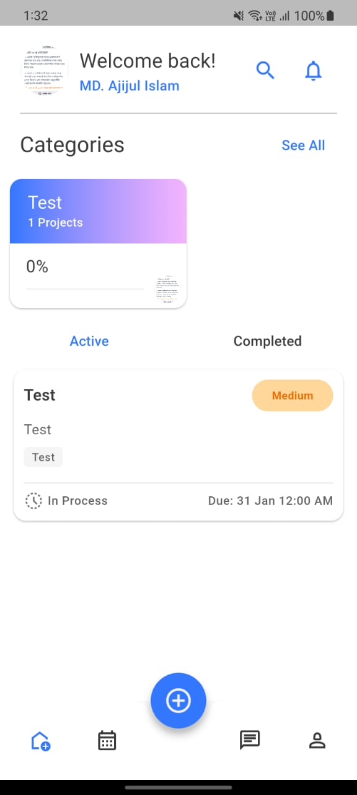
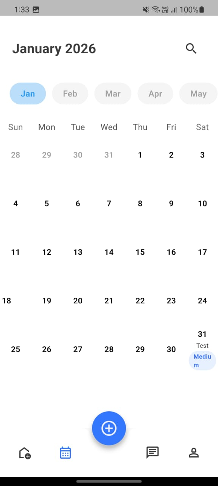
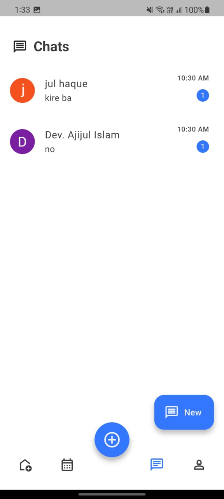
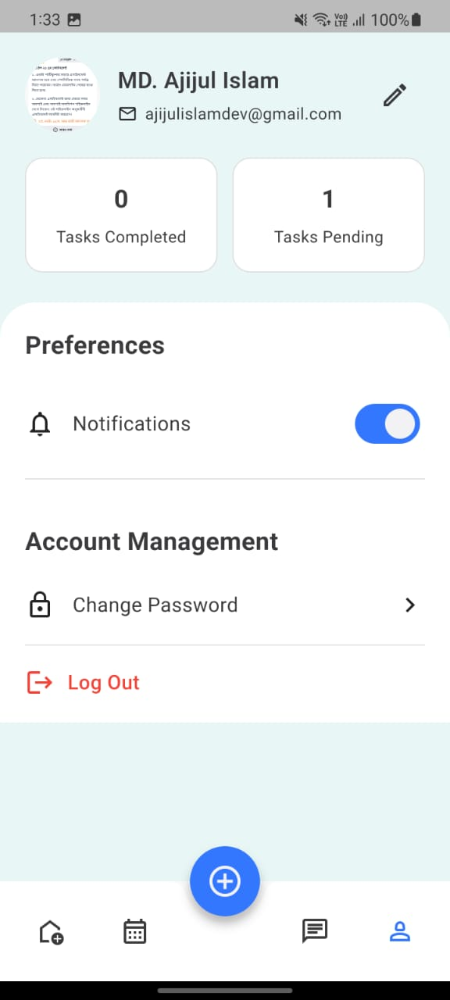
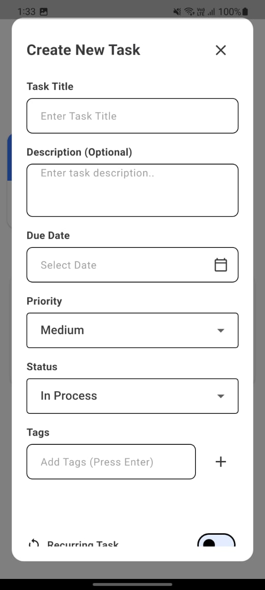
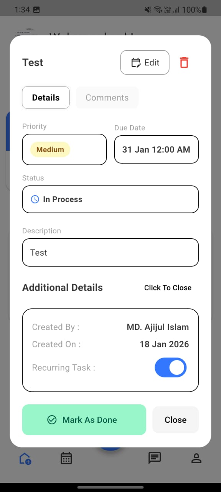
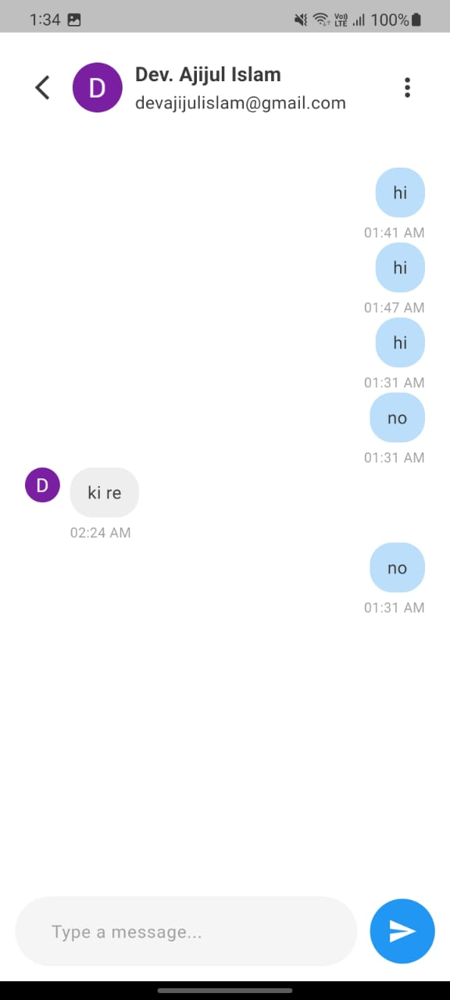
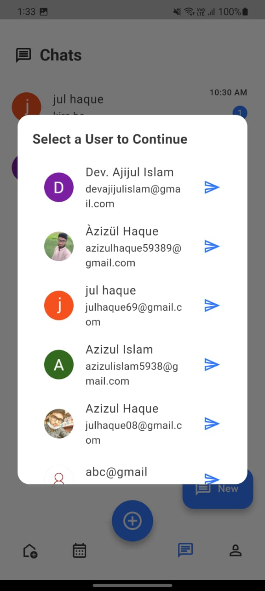
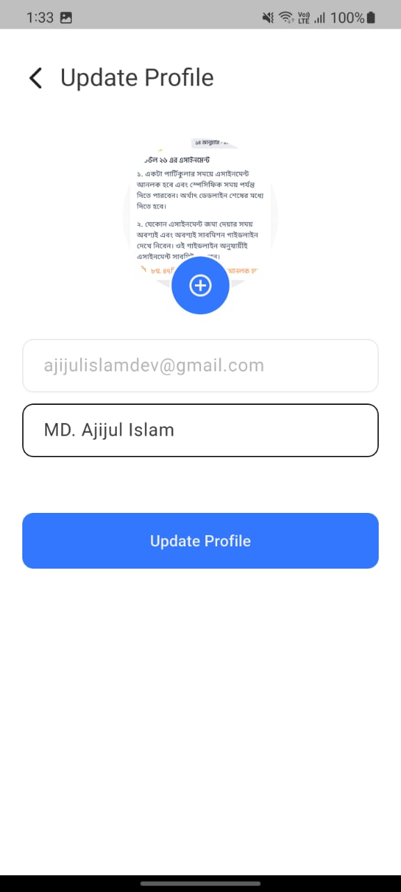

<div align="center">


# 📋 TaskFlow
**Smart Task & Project Management App**

[](https://flutter.dev/)
[](https://dart.dev/)
[](https://firebase.google.com/)
[](https://pub.dev/packages/get)


</div>

## 🌟 App Description

**TaskManager** is a modern productivity app built with **Flutter**, **Firebase**, and **MongoDB/Express backend**.  
It combines **task management**, **project tracking**, and a **real-time chat system** to create a collaborative workspace for individuals and teams.

---

## 📱 App Gallery

<div align="center">
  <table style="border: none;">
    <tr>
      <td align="center"><strong>Home Screen</strong></td>
      <td align="center"><strong>Calendar</strong></td>
      <td align="center"><strong>Chats screen</strong></td>
    </tr>
    <tr>
      <td></td>
      <td></td>
      <td></td>
    </tr>
    <tr>
      <td align="center"><strong>Profile</strong></td>
      <td align="center"><strong>Create Task</strong></td>
      <td align="center"><strong>Task details</strong></td>
    </tr>
    <tr>
      <td></td>
      <td></td>
      <td></td>
    </tr>
    <tr>
      <td align="center"><strong>Conversations</strong></td>
      <td align="center"><strong>Chat Selection</strong></td>
      <td align="center"><strong>Update profile</strong></td>
    </tr>
    <tr>
      <td></td>
      <td></td>
      <td></td>
    </tr>
  </table>
</div>
---

## ✨ Features

### 🔐 Authentication & Security
- Email/Password login with **mandatory email verification**
- Google Sign-In (Firebase Authentication)
- Secure JWT-based session handling
- Password reset flow
- Profile verification with Passport/ID upload

---

### ✅ Task & Project Management
- Create, edit, delete tasks and projects
- Priority levels (Low, Medium, High)
- Status tracking (Pending, In Process, Done)
- Recurring tasks (daily, weekly, indefinite)
- Calendar integration with **TableCalendar**
- Progress bars for project completion
- Tags for categorization

---

### 💬 Real-Time Chat System 
- **User-to-User Messaging**: Connect instantly with other app users
- **Smart User Selection**: Choose from a list of registered users with profile previews
- **Unread Indicators**: Stay updated with message alerts
- **Chat History Preservation**: Messages synced across sessions
- **Push Notifications**: Get notified when someone sends a message
- **Integrated with Tasks**: Chat directly from task/project views for collaboration
- **Clean UI**: Dedicated chat tab with intuitive navigation

This feature transforms TaskFlow into a **collaborative productivity hub**, not just a solo planner.

---

### 👤 Profile & Settings
- Update profile picture and name
- View task statistics (completed vs pending)
- Toggle notifications
- Change password
- Logout securely

---

### 🔔 Notifications
- Firebase Cloud Messaging integration
- Real-time alerts for tasks, projects, and chat messages

---

## ⚡ Tech Stack

| Technology | Usage |
|------------|-------|
| Flutter | Frontend UI development |
| Dart | Core language |
| Firebase | Authentication, messaging, storage |
| Node.js + Express | Backend REST API |
| MongoDB | Database |
| GetX | State management |
| TableCalendar | Calendar UI |
| SSLCommerz | Payment gateway (optional integration) |

---

## 📦 Dependencies

```yaml
carousel_slider: ^5.1.1
linear_progress_bar: ^2.0.0+2
avatar_stack: ^3.0.0
intl: ^0.20.2
get: ^4.7.3
table_calendar: ^3.2.0
firebase_core: ^4.3.0
firebase_auth: ^6.1.3
google_sign_in: ^7.2.0
cloud_firestore: ^6.1.1
get_storage: ^2.1.1
firebase_messaging: ^16.1.0
image_picker: ^1.2.1
http: ^1.6.0
flutter_launcher_icons: ^0.14.4
```

---

## 🚀 Getting Started

1. Clone the repo
   ```bash
   git clone https://github.com/dev-ajijul-islam/task_manager_firebase.git
   ```

2. Install dependencies
   ```bash
   flutter pub get
   ```

3. Configure Firebase
    - Add `google-services.json` (Android)
    - Add `GoogleService-Info.plist` (iOS)

4. Run the app
   ```bash
   flutter run
   ```


---

## 🧑‍💻 Developer Notes
- Modular, scalable, and maintainable codebase
- Firebase Admin SDK used on backend for token verification
- JWT-secured APIs
- Ready for deployment and future expansion

 **feature diagram (ASCII or Markdown flow)** showing how **tasks, projects, and chat interconnect** for collaboration?